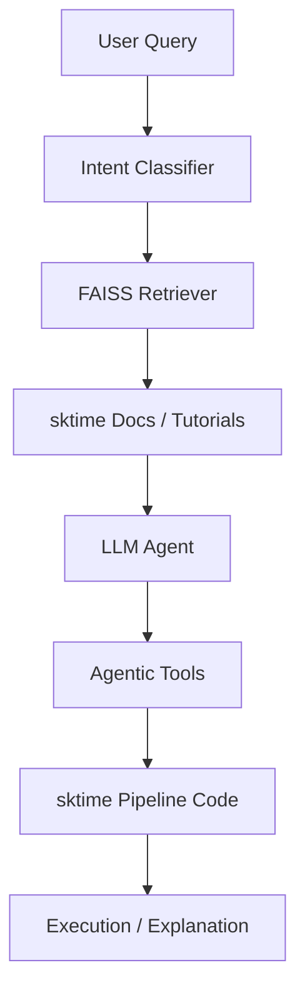

# 🤖 Agentic sktime Assistant
### *LLM-driven Time Series Workflow Generator & Agentic Pipeline Builder*

[](https://github.com/sktime/sktime)
[](https://opensource.org/licenses/MIT)

## 🌟 Overview
The **Agentic sktime Assistant** is a specialized agentic framework designed to bridge the gap between natural language intent and executable `sktime` workflows. It addresses the steep learning curve of the `sktime` ecosystem by using LLMs to autonomously construct forecasting, classification, and transformation pipelines.

This project is developed as part of the **European Summer of Code (ESoC) 2026**.

---

## 🚀 Key Features
- **Intent Recognition:** Autonomously classifies queries into tasks (Forecasting, Anomaly Detection, etc.).
- **Smart Retrieval:** Uses FAISS to pull relevant code snippets from the `sktime` documentation.
- **Dynamic Tooling:** Exposes `sktime` primitives as callable tools for LLM agents.
- **Streamlit Dashboard:** A premium, interactive UI for experimenting with agentic workflows.
- **CLI Interface:** A robust command-line tool for developers.

---

## 🛠️ System Architecture


---

## 📦 Installation
```bash
# Clone the repository
git clone https://github.com/Vinni5566/pycode-reviewer.git
cd pycode-reviewer

# Install dependencies
pip install -r requirements.txt
```

---

## 🔑 Gemini API Setup
This project uses **Gemini 1.5 Flash** for agentic reasoning. To set it up:
1. Obtain a free API Key from **[Google AI Studio](https://aistudio.google.com/app/apikey)**.
2. Create a `.env` file in the root directory.
3. Add your key to the file:
   ```env
   GOOGLE_API_KEY=your_key_here
   ```

---

## 🎮 Usage

### 1. Ingest Knowledge
Populate the RAG system with the latest `sktime` tutorial notebooks:
```bash
python scripts/fetch_docs.py
```

### 2. Interactive Dashboard
Run the premium Streamlit UI:
```bash
streamlit run sktime_agent/app.py
```

### 3. CLI Assistant
```bash
# Get a dummy workflow (Quick Demo)
python -m sktime_agent.cli "forecast sales for 12 months"

# Get a real LLM-reasoned workflow (Requires API Key)
python -m sktime_agent.cli "compare ARIMA vs Exponential Smoothing" --agent
```

---

## 📝 Roadmap & Future Extensions
- [ ] **Full sktime-mcp Integration:** Direct connection to the `sktime-mcp` server.
- [ ] **Data-Aware Pipeline Building:** Allowing the agent to inspect user data before suggesting estimators.
- [ ] **Foundation Model Support:** Integrating models like `Chronos` or `Lag-Llama` into the agent's toolbox.

## 📄 License
This project is licensed under the MIT License - see the [LICENSE](LICENSE) file for details.

---
**Built for the European Summer of Code (ESoC) 2026.**
