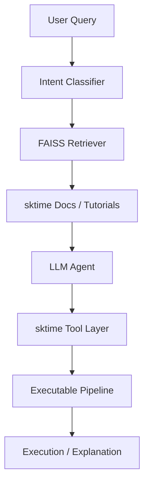

# 🤖 Agentic sktime Assistant
### *LLM-driven Time Series Workflow Generator & Agentic Pipeline Builder*

[](https://github.com/sktime/sktime)
[](https://opensource.org/licenses/MIT)

## 🌟 Overview
The **Agentic sktime Assistant** is an agentic interface layer for sktime enabling LLM-driven construction of forecasting pipelines using native sktime estimators and workflows. It significantly reduces the barrier for new users to construct correct sktime pipelines directly from natural language.

This project is developed as part of the **European Summer of Code (ESoC) 2026**.

---

## 🚀 Key Features
- **Intent Recognition:** Autonomously classifies queries into tasks (Forecasting, Anomaly Detection, etc.).
- **FAISS-based retrieval system:** Pulls relevant code snippets from the `sktime` documentation.
- **Streamlit interface:** An interactive UI for experimenting with agentic workflows.
- **CLI interface:** A command-line tool for developers.

## 🧠 sktime Integration Layer
Wraps core sktime estimators as callable tools (e.g., an ARIMA forecasting wrapper).
Converts LLM outputs into executable sktime pipelines and includes basic validation of generated pipelines using sktime evaluation utilities. Designed for future compatibility with `sktime-mcp`.

---

## 🛠️ System Architecture

**Box Flow Overview:**
`[User Query] ➔ [Intent Classifier] ➔ [sktime Retriever] ➔ [LLM Agent] ➔ [sktime Tool Layer] ➔ [Executable Pipeline]`



---

## 📦 Installation
```bash
# Clone the repository
git clone https://github.com/Vinni5566/sktime-agent.git
cd sktime-agent

# Install dependencies
pip install -r requirements.txt
```

---

## 🔑 Gemini API Setup
This project uses **Gemini 1.5 Flash** for agentic reasoning. To set it up:
1. Obtain a free API Key from **[Google AI Studio](https://aistudio.google.com/app/apikey)**.
2. Create a `.env` file in the root directory.
3. Add your key to the file:
   ```env
   GOOGLE_API_KEY=your_key_here
   ```

---

## 🎮 Usage

### 1. Ingest Knowledge
Populate the RAG system with the latest `sktime` tutorial notebooks:
```bash
python scripts/fetch_docs.py
```

### 2. Interactive Dashboard
Run the Streamlit interface:
```bash
streamlit run sktime_agent/app.py
```

### 3. CLI Assistant
```bash
# Get a dummy workflow (Quick Demo)
python -m sktime_agent.cli "forecast sales for 12 months"

# Get a real LLM-reasoned workflow (Requires API Key)
python -m sktime_agent.cli "compare ARIMA vs Exponential Smoothing" --agent
```

---

## 💡 Example

**Input:**
```text
forecast monthly sales for 12 months
```

**Output:**
```python
from sktime.forecasting.arima import ARIMA
from sktime.forecasting.base import ForecastingHorizon

model = ARIMA()
model.fit(y_train)
y_pred = model.predict(fh=ForecastingHorizon([1, 2, ..., 12]))
```

---

## 📝 Roadmap & Future Extensions
- [ ] **Full sktime-mcp Integration:** Direct connection to the `sktime-mcp` server.
- [ ] **Data-Aware Pipeline Building:** Allowing the agent to inspect user data before suggesting estimators.
- [ ] **Experimental support for foundation models:** Investigating potential wrappers for models like `Chronos` or `Lag-Llama`.

## 📄 License
This project is licensed under the MIT License - see the [LICENSE](LICENSE) file for details.

---
**Built for the European Summer of Code (ESoC) 2026.**
